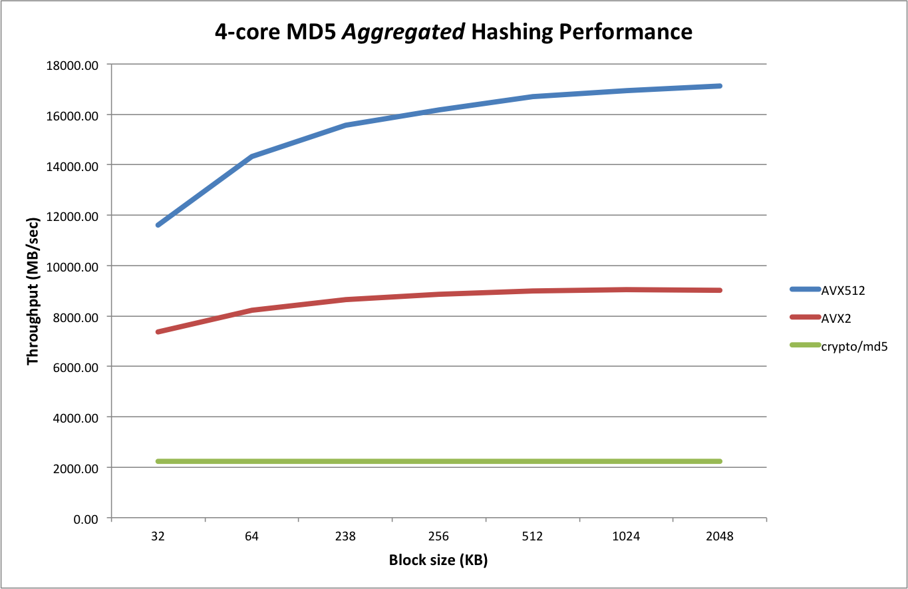

# md5-simd

This is a SIMD accelerated MD5 package, allowing up to either 8 (AVX2) or 16 (AVX512) independent MD5 sums to be calculated on a single CPU core.

It was originally based on the [md5vec](https://github.com/igneous-systems/md5vec) repository by Igneous Systems, but has been made more flexible by amongst others supporting different message sizes per lane and adding AVX512.

`md5-simd` integrates a similar mechanism as described in [minio/sha256-simd](https://github.com/minio/sha256-simd#support-for-avx512) for making it easy for clients to take advantages of the parallel nature of the MD5 calculation. This will result in reduced overall CPU load. 

It is important to understand that `md5-simd` **does not speed up** an individual MD5 hash sum (unless you would be using some hierarchical tree structure). Rather it allows multiple __independent__  MD5 sums to be computed in parallel on the same CPU core, thereby making more efficient usage of the computing resources.

## Usage

[](https://pkg.go.dev/github.com/minio/md5-simd?tab=doc)


In order to use `md5-simd`, you must first create an `Server` which can be 
used to instantiate one or more objects for MD5 hashing. 

These objects conform to the regular [`hash.Hash`](https://pkg.go.dev/hash?tab=doc#Hash) interface 
and as such the normal Write/Reset/Sum functionality works as expected. 

As an example: 
```
    // Create server
    server := md5simd.NewServer()
    defer server.Close()

    // Create hashing object (conforming to hash.Hash)
    md5Hash := server.NewHash()
    defer md5Hash.Close()

    // Write one (or more) blocks
    md5Hash.Write(block)
    
    // Return digest
    digest := md5Hash.Sum([]byte{})
```

To keep performance both a [Server](https://pkg.go.dev/github.com/minio/md5-simd?tab=doc#Server) 
and individual [Hasher](https://pkg.go.dev/github.com/minio/md5-simd?tab=doc#Hasher) should 
be closed using the `Close()` function when no longer needed.

A Hasher can efficiently be re-used by using [`Reset()`](https://pkg.go.dev/hash?tab=doc#Hash) functionality.

In case your system does not support the instructions required it will fall back to using `crypto/md5` for hashing.

## Limitations

As explained above `md5-simd` does not speed up an individual MD5 hash sum computation,
unless some hierarchical tree construct is used but this will result in different outcomes.

Instead, it allows running multiple MD5 calculations in parallel on a single CPU core. 
This can be beneficial in e.g. multi-threaded server applications where many go-routines 
are dealing with many requests and multiple MD5 calculations can be packed/scheduled for parallel execution on a single core.

This will result in a lower overall CPU usage as compared to using the standard `crypto/md5`
functionality where each MD5 hash computation will consume a single thread (core).

It is best to test and measure the overall CPU usage in a representative usage scenario in your application
to get an overall understanding of the benefits of `md5-simd` as compared to `crypto/md5`, ideally under heavy CPU load.

Also note that `md5-simd` is best meant to work with large objects, 
so if your application only hashes small objects of a few kilobytes 
you may be better of by using `crypto/md5`.

## Performance

For the best performance writes should be a multiple of 64 bytes, ideally a multiple of 32KB.
To help with that a [`buffered := bufio.NewWriterSize(hasher, 32<<10)`](https://golang.org/pkg/bufio/#NewWriterSize) 
can be inserted if you are unsure of the sizes of the writes. 
Remember to [flush](https://golang.org/pkg/bufio/#Writer.Flush) `buffered` before reading the hash. 

A single 'server' can process 16 streams concurrently with 1 core (AVX-512) or 2 cores (AVX2). 
In situations where it is likely that more than 16 streams are fully loaded it may be beneficial
to use multiple servers.

The following chart compares the multi-core performance between `crypto/md5` vs the AVX2 vs the AVX512 code:



Compared to `crypto/md5`, the AVX2 version is up to 4x faster:

```
benchcmp crypto-md5.txt avx2.txt 
benchmark                     old MB/s     new MB/s     speedup
BenchmarkParallel/32KB-4      2229.40      5745.47      2.58x
BenchmarkParallel/64KB-4      2233.49      6578.90      2.95x
BenchmarkParallel/128KB-4     2235.64      7395.15      3.31x
BenchmarkParallel/256KB-4     2237.07      8006.78      3.58x
BenchmarkParallel/512KB-4     2237.42      8392.50      3.75x
BenchmarkParallel/1MB-4       2232.63      8566.43      3.84x
BenchmarkParallel/2MB-4       2205.05      8618.54      3.91x
BenchmarkParallel/4MB-4       2205.85      8552.65      3.88x
BenchmarkParallel/8MB-4       2152.75      8483.01      3.94x
```

Compared to `crypto/md5`, the AVX512 is almost up to 8x faster (for larger block sizes):

```
$ benchcmp crypto-md5.txt avx512.txt
benchmark                     old MB/s     new MB/s     speedup
BenchmarkParallel/32KB-4      2229.40       7320.85     3.28x
BenchmarkParallel/64KB-4      2233.49       9491.57     4.25x
BenchmarkParallel/128KB-4     2235.64      11616.18     5.20x
BenchmarkParallel/256KB-4     2237.07      13291.86     5.94x
BenchmarkParallel/512KB-4     2237.42      14539.31     6.50x
BenchmarkParallel/1MB-4       2232.63      15464.00     6.93x
BenchmarkParallel/2MB-4       2205.05      15943.54     7.23x
BenchmarkParallel/4MB-4       2205.85      16021.47     7.26x
BenchmarkParallel/8MB-4       2152.75      15919.35     7.39x
```

These measurements were performed on AWS EC2 instance of type `c5.xlarge` equipped with a Xeon Platinum 8124M CPU at 3.0 GHz.

## Design & Tech

md5-simd has both an AVX2 (8-lane parallel), and an AVX512 (16-lane parallel version) algorithm to accelerate the computation with the following function definitions:
```
//go:noescape
func block8(state *uint32, base uintptr, bufs *int32, cache *byte, n int)

//go:noescape
func block16(state *uint32, ptrs *int64, mask uint64, n int)
```

The AVX2 version is based on the [md5vec](https://github.com/igneous-systems/md5vec) repository and is essentially unchanged except for minor (cosmetic) changes.

The AVX512 version is derived from the AVX2 version but adds some further optimizations and simplifications.

### Caching in upper ZMM registers

The AVX2 version passes in a `cache8` block of memory (about 0.5 KB) for temporary storage of intermediate results during `ROUND1` which are subsequently used during `ROUND2` through to `ROUND4`.

Since AVX512 has double the amount of registers (32 ZMM registers as compared to 16 YMM registers), it is possible to use the upper 16 ZMM registers for keeping the intermediate states on the CPU. As such, there is no need to pass in a corresponding `cache16` into the AVX512 block function.

### Direct loading using 64-bit pointers

The AVX2 uses the `VPGATHERDD` instruction (for YMM) to do a parallel load of 8 lanes using (8 independent) 32-bit offets. Since there is no control over how the 8 slices that are passed into the (Golang) `blockMd5` function are laid out into memory, it is not possible to derive a "base" address and corresponding offsets (all within 32-bits) for all 8 slices.

As such the AVX2 version uses an interim buffer to collect the byte slices to be hashed from all 8 inut slices and passed this buffer along with (fixed) 32-bit offsets into the assembly code.

For the AVX512 version this interim buffer is not needed since the AVX512 code uses a pair of `VPGATHERQD` instructions to directly dereference 64-bit pointers (from a base register address that is initialized to zero).

Note that two load (gather) instructions are needed because the AVX512 version processes 16-lanes in parallel, requiring 16 times 64-bit = 1024 bits in total to be loaded. A simple `VALIGND` and `VPORD` are subsequently used to merge the lower and upper halves together into a single ZMM register (that contains 16 lanes of 32-bit DWORDS).

### Masking support

Due to the fact that pointers are passed directly from the Golang slices, we need to protect against NULL pointers. 
For this a 16-bit mask is passed in the AVX512 assembly code which is used during the `VPGATHERQD` instructions to mask out lanes that could otherwise result in segment violations.

### Minor optimizations

The `roll` macro (three instructions on AVX2) is no longer needed for AVX512 and is replaced by a single `VPROLD` instruction.

Also several logical operations from the various ROUNDS of the AVX2 version could be combined into a single instruction using ternary logic (with the `VPTERMLOGD` instruction), resulting in a further simplification and speed-up.

## Low level block function performance

The benchmark below shows the (single thread) maximum performance of the `block()` function for AVX2 (having 8 lanes) and AVX512 (having 16 lanes). Also the baseline single-core performance from the standard `crypto/md5` package is shown for comparison.

```
BenchmarkCryptoMd5-4                     687.66 MB/s           0 B/op          0 allocs/op
BenchmarkBlock8-4                       4144.80 MB/s           0 B/op          0 allocs/op
BenchmarkBlock16-4                      8228.88 MB/s           0 B/op          0 allocs/op
```

## License

`md5-simd` is released under the MIT License. You can find the complete text in the file LICENSE.

## Contributing

Contributions are welcome, please send PRs for any enhancements.