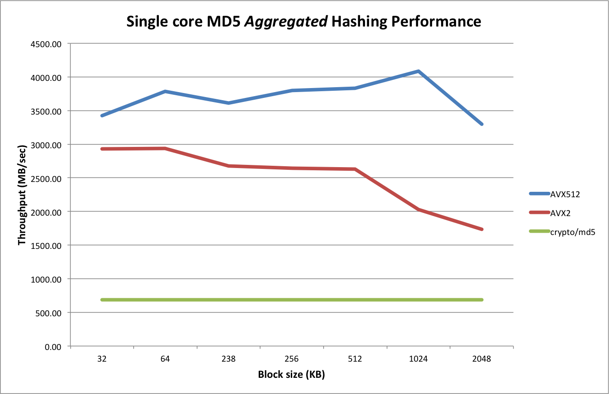

# md5-simd

This is a SIMD accelerated MD5 package, allowing up to either 8 (AVX2) or 16 (AVX512) independent MD5 sums to be calculated on a single CPU core.

It was originally based on the [md5vec](https://github.com/igneous-systems/md5vec) repository by Igneous Systems, but has been made more flexible by  amongst others supporting different message sizes per lane.

`md5-simd` integrates a similar mechanism as described in https://github.com/minio/sha256-simd#support-for-avx512 for making it easy for clients to take advantages of the parallel nature of the MD5 calculation. This will result in reduced overall CPU load. 

It is important to understand that `md5-simd` **does not speed up** an individual MD5 hash sum (unless you would be using some hierarchical tree structure). Rather it allows multiple __independent__  MD5 sums to be computed in parallel on the same CPU core, thereby making more efficient usage of the computing resources.
```
Example
```

## Performance

The following chart compares the single-core performance between `crypto/md5` vs the AVX2 vs the AVX512 code:



### block function
AVX2 (= 8 lanes) vs AVX512 (= 16 lanes) `block()` performance:

```
BenchmarkBlock8-4        9695575               124 ns/op        4144.80 MB/s           0 B/op          0 allocs/op
BenchmarkBlock16-4       7173894               167 ns/op        6122.07 MB/s           0 B/op          0 allocs/op
```

### hash.Hash

Compared to `crypto/md5`, the AVX2 version is about 2.5 to 3.5 times faster:

```
benchmark                   old MB/s     new MB/s     speedup
BenchmarkGolden/32KB-4      688.29       2928.75      4.26x
BenchmarkGolden/64KB-4      687.97       2937.95      4.27x
BenchmarkGolden/128KB-4     687.91       2676.93      3.89x
BenchmarkGolden/256KB-4     687.84       2644.37      3.84x
BenchmarkGolden/512KB-4     687.94       2630.64      3.82x
BenchmarkGolden/1MB-4       687.88       2030.45      2.95x
BenchmarkGolden/2MB-4       687.75       1732.51      2.52x
```

Compared to AVX2, the AVX512 is up to 2x faster (especially for larger blocks)

```
benchmark                   old MB/s     new MB/s     speedup
BenchmarkGolden/32KB-4      2928.75      3427.50      1.17x
BenchmarkGolden/64KB-4      2937.95      3788.35      1.29x
BenchmarkGolden/128KB-4     2676.93      3612.76      1.35x
BenchmarkGolden/256KB-4     2644.37      3800.89      1.44x
BenchmarkGolden/512KB-4     2630.64      3832.28      1.46x
BenchmarkGolden/1MB-4       2030.45      4086.52      2.01x
BenchmarkGolden/2MB-4       1732.51      3295.48      1.90x
```

## Design

md5-simd has both an AVX2 (8-lane parallel) and an AVX512 (16-lane parallel version) algorithm to accelerate the computation with the following function definitions:
```
//go:noescape
func block8(state *uint32, base uintptr, bufs *int32, cache *byte, n int)

//go:noescape
func block16(state *uint32, ptrs *int64, mask uint64, n int)
```

The AVX2 version is based on the [md5vec](https://github.com/igneous-systems/md5vec) repository and is essentially unchanged except for minor (cosmetic) changes.

The AVX512 version is derived from the AVX2 version but adds some further optimizations and simplifications.

### Caching in upper ZMM registers

The AVX2 version passes in a `cache8` block of memory (about 0.5 KB) for temporary storage of intermediate results during `ROUND1` which are subsequently used during `ROUND2` through to `ROUND4`.

Since AVX512 has double the amount of registers (32 ZMM registers as compared to 16 YMM registers), it is possible to use the upper 16 ZMM registers for keeping the intermediate states on the CPU. As such, there is no need to pass in a corresponding `cache16` into the AVX512 block function.

### Direct loading using 64-bit pointers

The AVX2 uses the `VPGATHERDD` instruction (for YMM) to do a parallel load of 8 lanes using (8 independent) 32-bit offets. Since there is no control over where the 8 slices that are passed into the (Golang) `blockMd5` function are laid out into memory, it is not possible to derive a "base" address and corresponding offsets for all 8 slices.

As such the AVX2 version uses an interim buffer to collect the byte slices to be hashed from all 8 inut slices and passed this buffer along with offets into the assembly code.

For the AVX512 version this interim buffer is not needed since the AVX512 code uses a pair of `VPGATHERQD` instructions to directly dereference 64-bit pointers (from a base register address that is zero).

Note that two instructions are needed because the AVX512 version processes 16-lanes in parallel, requiring 16x64 = 1024 bits in total. A simple `VALIGND` and `VPORD` are subsequently used to merge the lower and upper halves together into a total of 16 DWORDS.

### Masking support

Due to the fact that pointers are directly passed in from the Golang slices, we need to protect against NULL pointers. For this a 16-bit mask is passed in the AVX512 assembly code which is used during the `VPGATHERQD` instructions to mask out lanes that could otherwise result in segment violations.